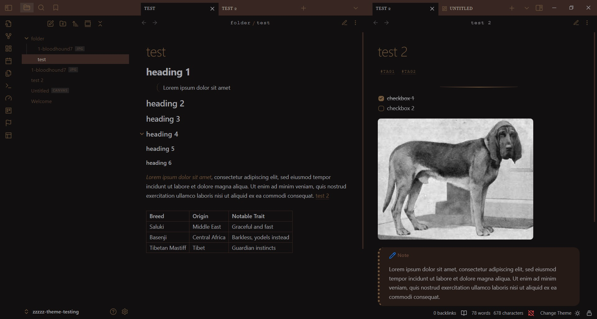
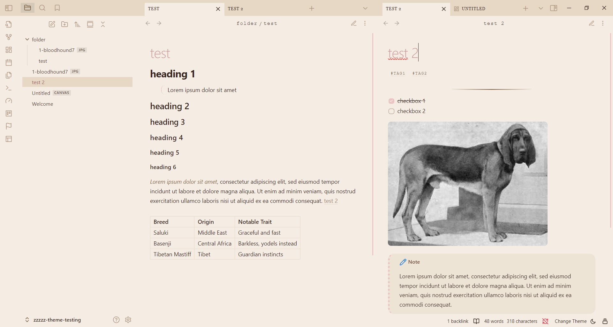

# Desserts

My old themes Parfait and Cocoa merged into one light/dark theme. They also have some small style edits.
Tweaks from Parfait have also been added to Cocoa to make it more visually interesting and more visually similar to the light theme as well.


The original Parfait and Cocoa themes are going to be retired once this one is published.


#### left-aligned text

I removed the left-aligned text in this version, you can, however, add this detail back if you prefer, with this simple css bit:

```
.markdown-preview-view.is-readable-line-width .markdown-preview-sizer {
     margin-left: -1px; 
}
```

(Add this in the theme css itself, not as separate snippet.)


#### modes

dark mode (Cocoa): 



light mode (Parfait):



